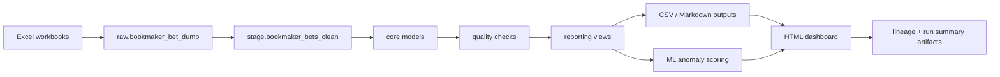

# Data Lineage Report

Generated at: `2026-05-02T00:00:00`

## Run Scope

- Pipeline: `betting-data-integrity-pipeline`
- Lineage version: `1.0`
- Raw directory: `ci_artifacts/demo_raw`
- Output directory: `ci_artifacts/demo_processed`
- Source files: `1`
- Generated artifacts inventoried: `1`

## Source Files

- `demo_bookmaker_bet_dump.xlsx`

## Lineage Flow

## Processing Stages

### Raw PostgreSQL ingestion

- Stage ID: `raw_ingestion`
- Layer: `raw`
- Description: Workbook rows are loaded with source file, source row number, source UUID, and ingestion metadata.

## Artifact Inventory

| artifact | size_bytes | purpose |
| --- | ---: | --- |
| `integrity_dashboard.html` | 10968 | Static portfolio dashboard for browser-based review. |
